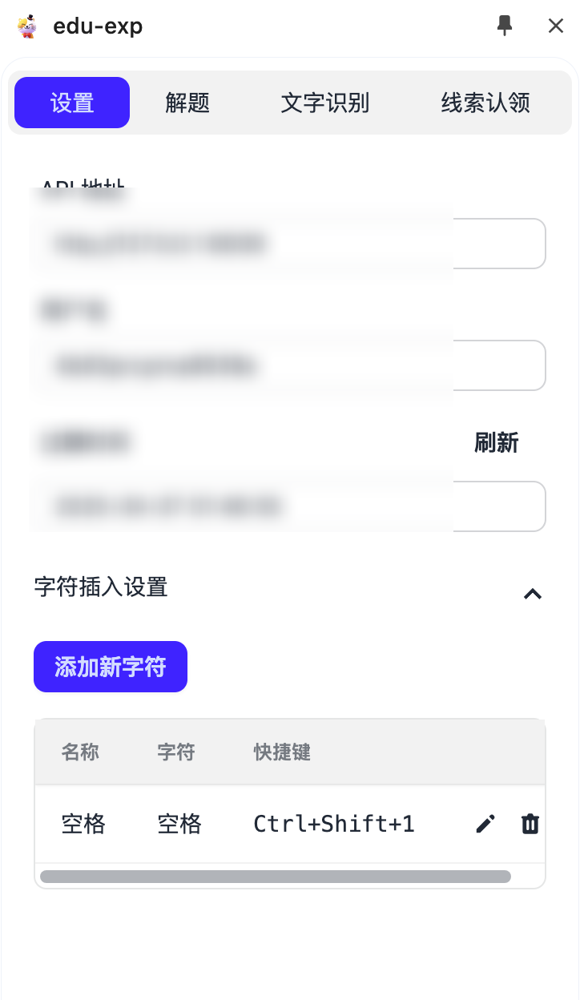
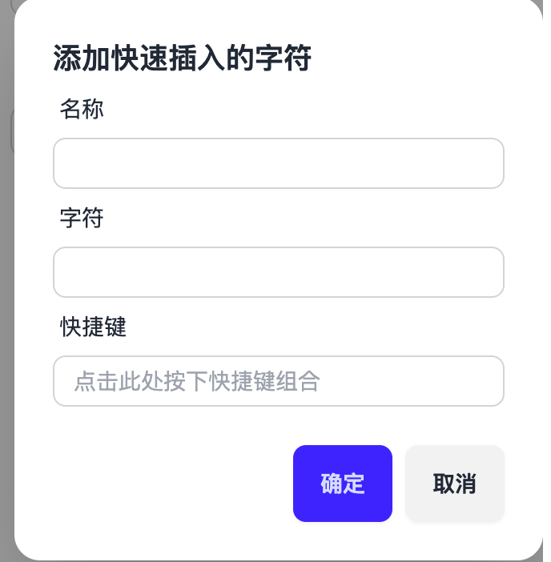

# 字符插入功能

## 功能介绍

字符插入功能允许您设置固定的字符或文本，并为其分配快捷键。当您需要在任何输入框中输入这些预设字符时，只需按下对应的快捷键，系统将自动插入您预先设置的内容。

这个功能对于经常需要输入特殊符号、固定格式文本或重复使用的短语非常有用。

## 设置方法

### 添加新的字符插入设置

1. 点击界面上的 "设置" 选项卡
2. 向下滚动页面，找到 "字符插入设置" 部分
3. 点击展开 "字符插入设置" 下拉菜单

4. 点击 "添加新字符" 按钮

5. 在弹出的表单中填写以下信息：
   - **名称**：为这个字符设置一个易于识别的名称
   - **字符内容**：输入您希望插入的字符或文本
   - **快捷键**：设置用于触发插入的键盘快捷键组合

6. 点击 "保存" 完成设置

### 使用字符插入功能

1. 将光标放置在任何需要输入的文本框中
2. 按下您之前设置的快捷键
3. 系统将自动在光标位置插入您预设的字符或文本

## 示例

假设您经常需要输入版权符号 "©"：

1. 在字符插入设置中添加新字符：
   - 名称：版权符号
   - 字符内容：©
   - 快捷键：Ctrl+Alt+C（您可以根据个人喜好设置其他组合）

2. 当您需要输入版权符号时，只需在任何输入框中按下 Ctrl+Alt+C，系统将自动插入 © 符号。

## 管理已有字符设置

您可以随时返回 "设置" 选项卡中的 "字符插入设置" 部分：

- 编辑现有的字符设置
- 删除不再需要的字符设置
- 添加新的字符设置

## 注意事项

- 请避免使用系统已占用的快捷键组合
- 字符内容可以是单个字符，也可以是多行文本
- 快捷键设置支持组合键（如 Ctrl+Shift+A）
